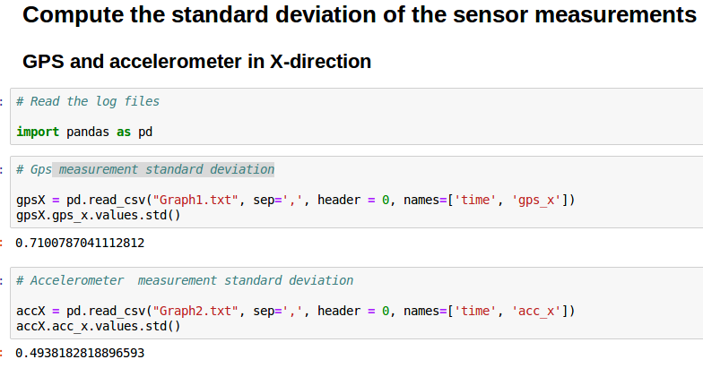
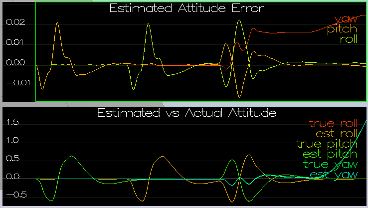
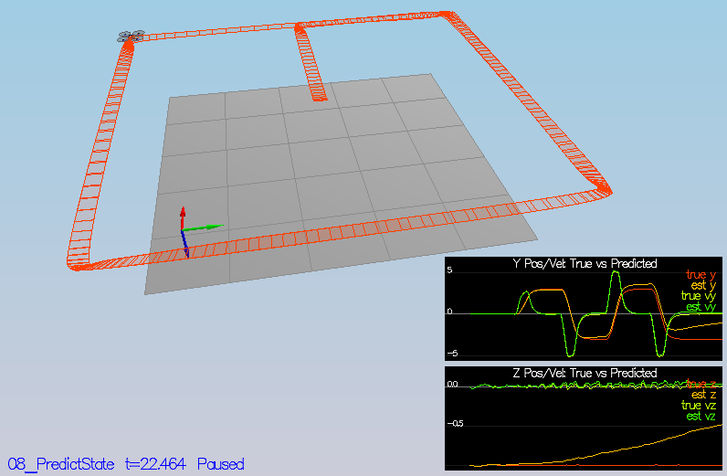
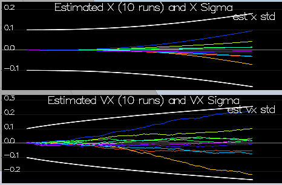
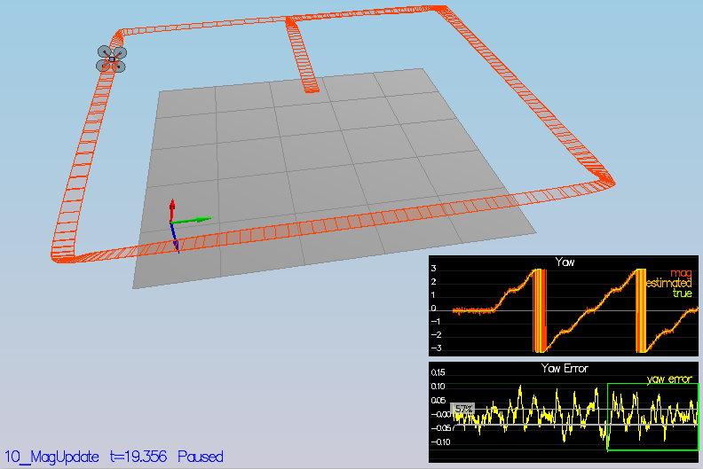
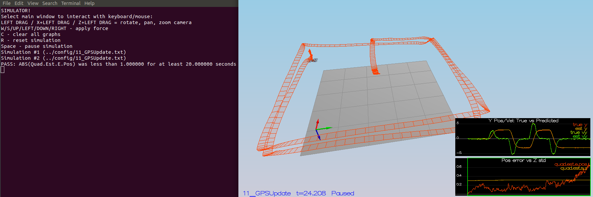
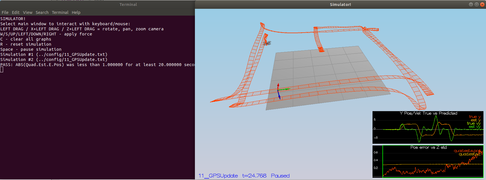

# Estimation Project #

Welcome to the estimation project.  In this project, I will be developing the estimation portion of the controller used in the CPP simulator.  

## The Tasks ##

I will be building up the estimator in pieces.  At each step, there will be a set of success criteria that will be displayed both in the plots and in the terminal output.

Project outline:

 - [Step 1: Sensor Noise](#step-1-sensor-noise)
 - [Step 2: Attitude Estimation](#step-2-attitude-estimation)
 - [Step 3: Prediction Step](#step-3-prediction-step)
 - [Step 4: Magnetometer Update](#step-4-magnetometer-update)
 - [Step 5: Closed Loop + GPS Update](#step-5-closed-loop--gps-update)
 - [Step 6: Adding Your Controller](#step-6-adding-your-controller)


### Step 1: Sensor Noise ###

For the controls project, the simulator was working with a perfect set of sensors, meaning none of the sensors had any noise.  The first step to adding additional realism to the problem, and developing an estimator, is adding noise to the quad's sensors.  For the first step, you will collect some simulated noisy sensor data and estimate the standard deviation of the quad's sensor.

1. Run the simulator

2. Choose scenario `06_SensorNoise`.  In this simulation, the interest is to record some sensor data on a static quad, so you will not see the quad move.  You will see two plots at the bottom, one for GPS X position and one for The accelerometer's x measurement.  The dashed lines are a visualization of a single standard deviation from 0 for each signal. The standard deviations are initially set to arbitrary values (after processing the data in the next step, you will be adjusting these values).  If they were set correctly, we should see ~68% of the measurement points fall into the +/- 1 sigma bound.  When you run this scenario, the graphs you see will be recorded to the following csv files with headers: `config/log/Graph1.txt` (GPS X data) and `config/log/Graph2.txt` (Accelerometer X data).

3. Process the logged files to figure out the standard deviation of the the GPS X signal and the IMU Accelerometer X signal.

     

4. Plug in your result into the top of `config/6_Sensornoise.txt`.  Specially, set the values for `MeasuredStdDev_GPSPosXY` and `MeasuredStdDev_AccelXY` to be the values you have calculated.

5. Run the simulator.

***Success criteria:*** *The standard deviations accurately capture the value of approximately 68% of the respective measurements.*


### Step 2: Attitude Estimation ###

Now let's look at the first step to our state estimation: including information from our IMU.  In this step, the complementary filter-type attitude filter has to be improved with a better rate gyro attitude integration scheme. The hypothesis that the angular velocity (body frame) can be used directly as angular rotation (global frame) is no longer valid.

1. Run scenario `07_AttitudeEstimation`.  For this simulation, the only sensor used is the IMU and noise levels are set to 0 (see `config/07_AttitudeEstimation.txt` for all the settings for this simulation).  There are two plots visible in this simulation.
   - The top graph is showing errors in each of the estimated Euler angles.
   - The bottom shows the true Euler angles and the estimates. Observe that there’s quite a bit of error in attitude estimation (left graphs).

   

2. In `QuadEstimatorEKF.cpp`, the function `UpdateFromIMU()` contains a complementary filter-type attitude filter.  To reduce the errors in the estimated attitude (Euler Angles), a better rate gyro attitude integration scheme has been implemented.  The attitude errors are reduced to get within 0.1 rad for each of the Euler angles, as shown in the screenshot above (right graphs).
    - Use of the Euler angles
    - From the gyro the angular velocity in the global frame are known, i.e. (p, q, r)
    - The Euler angle rates can be computed applying the rotation matrix R (see part 4, lesson 2.10) to the angular velocities, i.e. (phi_dot, theta_dot, psi_dot) = R*(p, q, r)
    - The Euler angle rates are integrated with the *Euler forward method* to get the new Euler angle estimates (phi, theta, psi)
    

***Success criteria:*** *The attitude estimator gets within 0.1 rad for each of the Euler angles for at least 3 seconds. See error plots above.*


### Step 3: Prediction Step ###

In this step the prediction step of the filter is implemented.


1. Run scenario `08_PredictState`.  This scenario is configured to use a perfect IMU (only an IMU). Due to the sensitivity of double-integration to attitude errors, we've made the accelerometer update very insignificant (`QuadEstimatorEKF.attitudeTau = 100`).  The plots on this simulation show element of your estimated state and that of the true state.  At the moment you should see that your estimated state does not follow the true state.

2. In `QuadEstimatorEKF.cpp`, implement the state prediction step in the `PredictState()` functon. The estimator state tracks the actual state, with only reasonably slow drift, as shown in the figure below:

    

    The following steps have been followed to predict the new state:
    - Predict position: (x,y,z)<sub>predict</sub> = (x,y,z)<sub>t</sub> + dt*(x<sub>dot</sub>,y<sub>dot</sub>,z<sub>dot</sub>)
    - Predict velocity: note that the acceleration is in body frame, thus before integration one has to transform the acceleration from the body to the inertial frame. The rotation can be computed from the function in the quaternion class: Rotate_BtoI(<V3F>), i.e. acc<sub>global</sub> = attitude.Rotate_BtoI(acc<sub>body</sub>). Then integrate to get the velocity: (x<sub>dot</sub>,y<sub>dot</sub>,z<sub>dot</sub>)<sub>predict</sub> = (x<sub>dot</sub>,y<sub>dot</sub>,z<sub>dot</sub>)<sub>t</sub> + dt*(x<sub>dot-dot</sub>,y<sub>dot-dot</sub>,z<sub>dot-dot</sub>)
    - No prediction step is necessary for psi, as it was already done

3. Now let's introduce a realistic IMU, one with noise.  Run scenario `09_PredictionCov`. You will see a small fleet of quadcopter all using your prediction code to integrate forward. You will see two plots:
   - The top graph shows 10 (prediction-only) position X estimates
   - The bottom graph shows 10 (prediction-only) velocity estimates
You will notice however that the estimated covariance (white bounds) currently do not capture the growing errors.

4. In `QuadEstimatorEKF.cpp`, calculate the partial derivative of the body-to-global rotation matrix in the function `GetRbgPrime()`:
   - the matrix components have been taken from eq.(52) in [Estimation for Quadrotors](https://www.overleaf.com/read/vymfngphcccj) manuscript.  

   Implement the rest of the prediction step (predict the state covariance forward) in `Predict()`:
   - the matrix gPrime has been filled according to eq.(50) in [Estimation for Quadrotors](https://www.overleaf.com/read/vymfngphcccj) manuscript. The control input is u<sub>t</sub> = (acc<sub>x</sub>, acc<sub>y</sub>, acc<sub>z</sub>, psi-dot-dot)
   - the predicted covariance is computed as follow: ekfCov<sub>t</sub> = gPrime<sub>t</sub> ekfCov<sub>t-1</sub> gPrime<sub>t</sub><sup>T</sup> + Q<sub>t</sub>

5. Run your covariance prediction and tune the `QPosXYStd` and the `QVelXYStd` process parameters in `QuadEstimatorEKF.txt` to try to capture the magnitude of the error for a relatively short prediction period (the scenario is set for one second).  My solution with `QPosXYStd = 0.01` and `QVelXYStd = 0.25` looks as follow:

  


### Step 4: Magnetometer Update ###

Up until now we've only used the accelerometer and gyro for our state estimation.  In this step, you will be adding the information from the magnetometer to improve your filter's performance in estimating the vehicle's heading.

1. Run scenario `10_MagUpdate`.  This scenario uses a realistic IMU, but the magnetometer update hasn’t been implemented yet. As a result, the estimate yaw is drifting away from the real value (and the estimated standard deviation is also increasing).  Note that in this case the plot is showing you the estimated yaw error (`quad.est.e.yaw`), which is drifting away from zero as the simulation runs.  The estimated standard deviation of that state (white boundary) is also increasing.

2. Tune the parameter `QYawStd` (`QuadEstimatorEKF.txt`) for the QuadEstimatorEKF so that it approximately captures the magnitude of the drift: `QYawStd = 0.07`

3. Implement magnetometer update in the function `UpdateFromMag()`.  See section 7.3.2 of [Estimation for Quadrotors](https://www.overleaf.com/read/vymfngphcccj) for the magnetometer update. The resulting plot is reported below, with `QYawStd = 0.08`.

  

  ***Success criteria:*** *Your goal is to both have an estimated standard deviation that accurately captures the error and maintain an error of less than 0.1rad in heading for at least 10 seconds of the simulation.*


### Step 5: Closed Loop + GPS Update ###

1. Run scenario `11_GPSUpdate`.  At the moment this scenario is using both an ideal estimator and and ideal IMU.  Even with these ideal elements, watch the position and velocity errors (bottom right). As you see they are drifting away, since GPS update is not yet implemented.

2. Let's change to using your estimator by setting `Quad.UseIdealEstimator` to 0 in `config/11_GPSUpdate.txt`.  Rerun the scenario to get an idea of how well your estimator work with an ideal IMU.

3. Now repeat with realistic IMU by commenting out these lines in `config/11_GPSUpdate.txt`:
```
#SimIMU.AccelStd = 0,0,0
#SimIMU.GyroStd = 0,0,0
```

4. Tune the process noise model in `QuadEstimatorEKF.txt` to try to approximately capture the error you see with the estimated uncertainty (standard deviation) of the filter.

5. Implement the EKF GPS Update in the function `UpdateFromGPS()`. Refer to section 7.3.1 of [Estimation for Quadrotors](https://www.overleaf.com/read/vymfngphcccj) for the equations.

6. Now once again re-run the simulation.  Your objective is to complete the entire simulation cycle with estimated position error of < 1m (you’ll see a green box over the bottom graph if you succeed).  You may want to try experimenting with the GPS update parameters to try and get better performance.

  ***Success criteria:*** *Your objective is to complete the entire simulation cycle with estimated position error of < 1m.* The resulting simulation is reported in the figure below.

  


At this point, I have a working estimator!

### Step 6: Adding Your Controller ###

Up to this point, we have been working with a controller that has been relaxed to work with an estimated state instead of a real state.  So now, you will see how well your controller performs and de-tune your controller accordingly.

1. Replace `QuadController.cpp` with the controller you wrote in the last project.

2. Replace `QuadControlParams.txt` with the control parameters you came up with in the last project.

3. Run scenario `11_GPSUpdate`. If your controller crashes immediately do not panic. Flying from an estimated state (even with ideal sensors) is very different from flying with ideal pose. You may need to de-tune your controller. Decrease the position and velocity gains (we’ve seen about 30% detuning being effective) to stabilize it.  Your goal is to once again complete the entire simulation cycle with an estimated position error of < 1m.

***Success criteria:*** *The entire simulation cycle is completed with estimated position error of < 1m.*




#### Authors ####

Thanks to Fotokite for the initial development of the project code and simulator.
